## Índice

1. [Ejercicio 1](#enunciado-ejercicio-1)
2. [Ejercicio 2](#enunciado-ejercicio-2)
3. [Ejercicio 3](#enunciado-ejercicio-3)
4. [Ejercicio 4](#enunciado-ejercicio-4)
5. [Ejercicio 5](#enunciado-ejercicio-5)
6. [Bibliografía](#bibliografia)
7. [Conclusiones](#conclusiones)

---

## Contenido

### <a name="enunciado-ejercicio-1"></a>Ejercicio 1

#### Enunciado

Realiza un script llamado comprobarApache.sh, que compruebe cada minuto si el 
servicio apache2 está activo (running). 

Si está parado, entonces:

>1.- Introduce una línea: “Error-Apache: Fecha y hora actual” en /root/ApacheError.tmp, 
>donde FechaActual, representa día, mes, año, hora y minuto.

>2.- Reinicia el servicio apache2.
>Para comprobarlo, para el servicio. Ejecuta el script en segundo plano y observa si lo 
>reinicia y crea el archivo.

>3.- Además del script, crea una tarea programada, de forma que ese script se ejecute cada 
>6 horas, todos los días. Y si el ordenador está apagado, se debe ejecutar la próxima vez 
>que se inicie, transcurrido cinco minutos.

#### Desarrollo

```sh
#!/bin/bash
#Autores: German Lamela, José Manuel Carmona y Antonio Tenorio.
#Versión: 1.0
#Descripción: Ejercicio 1. Comprueba cada minuto que el servicio Apache2 esté activo y tiene una tarea programada para que se ejecute cada 6 horas todos los días, si el pc está apagado.
#Fecha: 01/05/2024
#Bloque principal

# Comprobamos si el servicio Apache está activo.
existe=$(systemctl status apache2 | grep -w "active")	
if ! [ -z "$existe" ]; 
then
	echo "Apache está en ejecución."
else
	fechaActual=$(date "+%d-%m-%Y %H:%M")
	echo "Error-Apache: $fechaActual" >> /root/ApacheError.tmp

	# Reiniciamos el servicio Apache.
	sudo systemctl restart apache2
	echo "Apache se esta reiniciado..."
fi
```
### Desarrollo

1. **Objetivo**
   - Necesitábamos un script que revisara periódicamente el estado del servicio Apache y lo reiniciara si no estaba activo. Queríamos asegurarnos de que nuestro servidor web estuviera siempre disponible y minimizar el tiempo de inactividad.

2. **Recolección de Requisitos**
   - **Funcionalidad Principal**: El script debe verificar cada minuto si Apache está activo.
   - **Reinicio Automático**: Si detecta que Apache no está activo, el script debe reiniciarlo automáticamente.
   - **Registro de Errores**: Registrar la fecha y hora de cada reinicio en un archivo para llevar un control de los eventos.
   - **Tarea Programada**: Configurar una tarea cron que ejecute el script cada minuto y otra que se ejecute cada 6 horas para asegurar que también funcione si el PC estuvo apagado.

3. **Diseño del Script**
   - **Verificación del Estado**: Usamos el comando `systemctl status apache2` y filtramos el resultado para encontrar el estado "active".
   - **Condicional para el Reinicio**: Si Apache no está activo, el script lo reinicia y registra el evento.
   - **Registro de Errores**: Guardamos la fecha y hora del evento de reinicio en un archivo temporal (`/root/ApacheError.tmp`).


#### Solución final

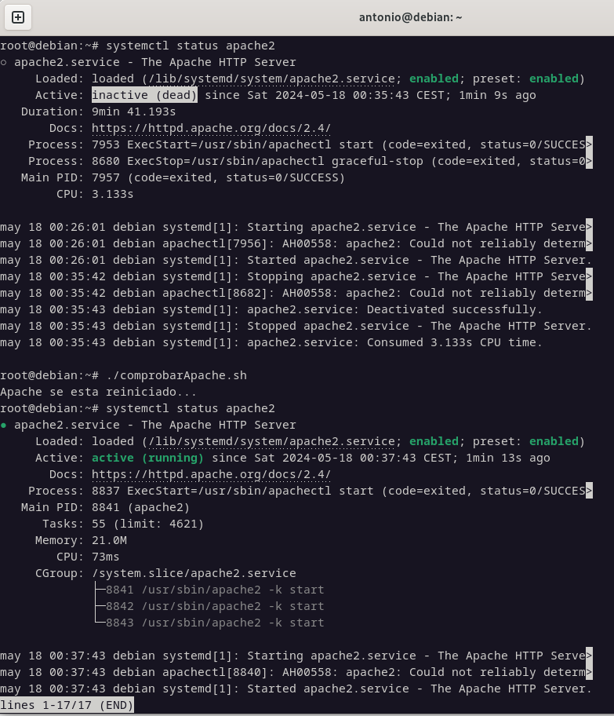

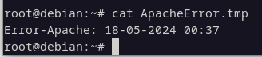


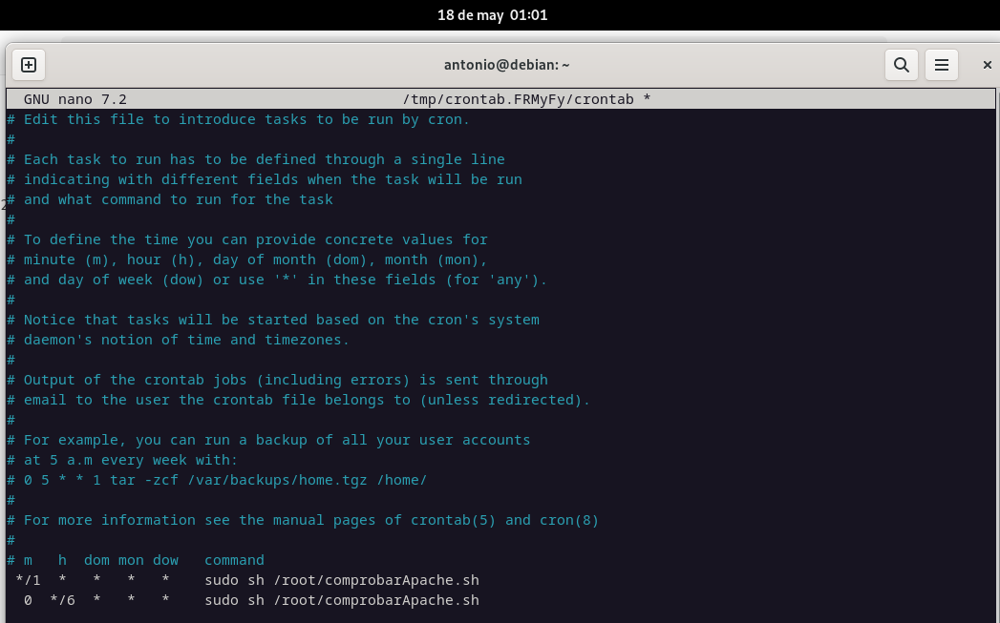

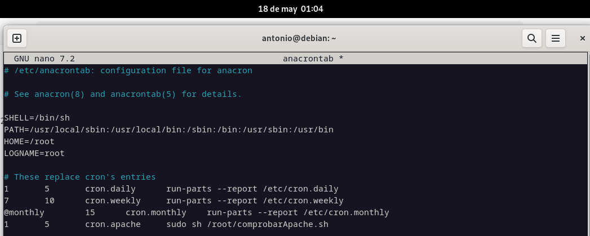

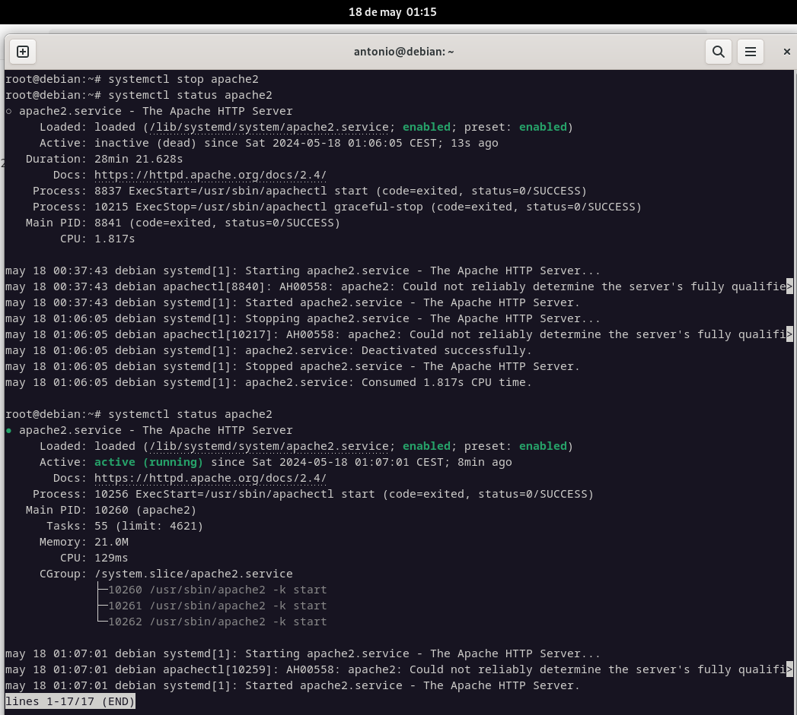


---

### <a name="enunciado-ejercicio-2"></a>Ejercicio 2

#### Enunciado

Realiza un script llamado usuariosBloqueados.sh, que nos muestre un menú:


  >1.- Usuarios Bloqueados.
  
  >2.- Bloquear un usuario.
  
  >3.- Desbloquear usuario.
  
  >4.- Cerrar sesión usuario
  
  >5.- Salir

  
Cada opción del menú corresponde con una función.

- UsuariosBloqueados → nos muestra en pantalla los usuarios (uid>1000 y <2000) que 
tengan la cuenta bloqueada.

- BloquearUsuario → Nos pregunta el nombre de un usuario y lo bloqueamos.

- DesbloquearUsuario → Nos pregunta el nombre de un usuario y lo desbloqueamos.

- CerrarSesion → Nos pregunta el nombre de un usuario, y si el usuario lleva más de 30 
minutos (1800 seg) sin actividad, se le cierra la sesión.


#### Código

```sh
#!/bin/bash
#Autores: German Lamela, José Manuel Carmona y Antonio Tenorio.
#Versión: 1.0
#Descripción: Ejercicio 2
#Fecha: 10/05/2024
#Funciones

clear

usuariosBloqueados() {
	echo "Usuarios bloqueados:"
	sudo awk -F':' '$3 >= 1000 && $3 < 2000 { system("passwd -S " $1) }' /etc/passwd | awk '$2 == "L" { print $1 }'
}

bloquearUsuario() {
	read -p "Introduce el nombre de usuario a bloquear: " usuario
	usermod -L $usuario 2>&1
	exit 1
	echo "El usuario $usuario ha sido bloqueado."
}

desbloquearUsuario() {
	read -p "Introduce el nombre de usuario a desbloquear: " usuario
	usermod -U $usuario 2>&1
	exit 1
	echo "El usuario $usuario ha sido desbloqueado."
}

cerrarSesionUsuario() {

# Solicitamos el nombre del usuario/a al que queremos cerrarle sesion.
	read -p "Introduce el nombre de usuario/a a cerrar sesion: " usuario

# Verificamos si el usuario/a está conectado.
	if who | grep -qw "$usuario"; then

# Obtenemos el tiempo de inactividad del usuario/a.
	tiempoInactivo=$(w -h | awk -v user="$usuario" '$1 == user { print $5 }' | \
awk -F: '{
    if (NF == 3) {
        # Formato HH:MM:SS
        print ($1 * 3600) + ($2 * 60) + $3
    } else if (NF == 2) {
        # Formato MM:SS
        print ($1 * 60) + $2
    } else {
        # Formato SS
        print $1
    }
}')

# Comparamos el tiempo que el usuario/a lleva de inactividad, como máximo puede estar 1800 segundos (30 minutos).
    if [ "$tiempoInactivo" -gt 1800 ] 2> /dev/null
    then 
	# Cerramos la sesión del usuario/a.
	pkill -KILL -u "$usuario" 
        echo "La sesión del $usuario ha sido cerrada debido a una prolongada inactividad."
    else
        echo "El usuario $usuario está activo." 
    fi
    else
    echo "El usuario $usuario no está conectado actualmente."
fi

}

#Bloque principal
while true; 
do
	echo "-----------MENU-----------"
	echo "1.- Usuarios Bloqueados."
	echo "2.- Bloquear un usuario."
	echo "3.- Desbloquear usuario."
	echo "4.- Cerrar sesion usuario."
	echo "5.- Salir."
	
	read -p "Selecciona una opción: " opcion

	case $opcion in
	
	1)
		usuariosBloqueados
	;;
	
	2)
		bloquearUsuario
	;;

	3)
		desbloquearUsuario
	;;

	4)
		cerrarSesionUsuario
	;;

	5)
		exit
	;;

		*)

		echo "Opcion no valida. Por favor, selecciona una opción del menu. "
	;;

	esac
	echo " "
done


```

### Desarrollo
1. **Objetivo**
   - Crear un script que permita gestionar usuarios en un sistema Linux, específicamente para listar usuarios bloqueados, bloquear y desbloquear usuarios, y cerrar la sesión de usuarios inactivos.
   - **Razón**: Facilitar la administración de usuarios, mejorar la seguridad y garantizar que los usuarios inactivos no consuman recursos del sistema innecesariamente.

2. **Recolección de Requisitos**
   - **Funcionalidad Principal**: El script debe proporcionar un menú interactivo con opciones para:
     - Listar usuarios bloqueados.
     - Bloquear usuarios.
     - Desbloquear usuarios.
     - Cerrar la sesión de usuarios inactivos.
   - **Interactividad**: Utilizar `read` para solicitar entradas del usuario y `case` para manejar las opciones del menú.
   - **Permisos de Usuario**: Ejecutar comandos con permisos suficientes (por ejemplo, `sudo` para modificar usuarios).

3. **Diseño del Script**
   - **Estructura del Menú**: Un bucle `while` que presenta un menú con las opciones y ejecuta las funciones correspondientes según la elección del usuario.
   - **Funciones Principales**:
     - `usuariosBloqueados()`: Lista los usuarios bloqueados.
     - `bloquearUsuario()`: Bloquea un usuario específico.
     - `desbloquearUsuario()`: Desbloquea un usuario específico.
     - `cerrarSesionUsuario()`: Cierra la sesión de un usuario inactivo.
   - **Manejo de Inactividad**: Calcular el tiempo de inactividad de un usuario y cerrar la sesión si supera un límite establecido (30 minutos).
   - **Problema y solución**: En el punto 4 nos encontramos con el problema de que cerraba la sesión independientemente del tiempo de inactividad. Finalmente logramos que funcionará, pero a la hora de probarlo lo hicimos usando un límite de 5 minutos, para no tener que esperar media hora para la comprobación.


#### Solución final

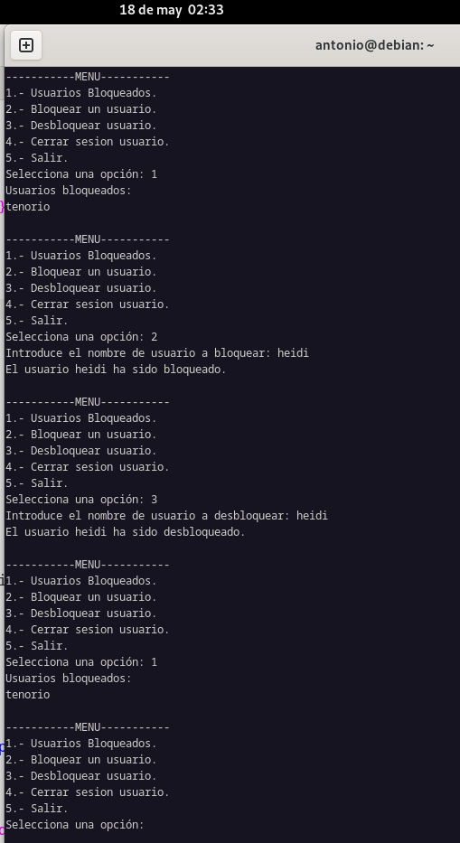

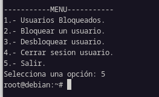

---

### <a name="enunciado-ejercicio-3"></a>Ejercicio 3

#### Enunciado

Realiza un script llamado crearBorrarUsuarios.sh, que nos muestre un menú:

>1.- Crear Usuarios.

>2.- Borrar Usuarios.

>3.- Salir

- CrearUsuarios → Crea de forma masiva usuarios almacenados en el fichero 
/root/usuarios.csv

Los campos son los siguientes:

- El campo 1 representa el nombre de usuario.
- El campo 2 representa la contraseña.
- El campo 3 representa el nombre.
- El campo 4 representa su primer apellido.
- El campo 5 representa su correo electrónico.
  
Además, queremos que esas cuentas queden inactivas el 30 de junio de 2024.

- BorrarUsuarios → Borra de forma masiva usuarios almacenados en el fichero 
/root/usuarios.csv.

#### Código

```sh
#!/bin/bash
#Autores: German Lamela, José Manuel Carmona y Antonio Tenorio.
#Versión: 1.0
#Descripción: Ejercicio 3. Muestra un menú interactivo que permite a los usuario/as elegir entre crear usuarios/as, borrar usuarios/as o salir del script.
#Fecha: 10/05/2024
#Funciones

clear

# Función para crear usuarios
crearUsuarios() {
    echo "Creando usuarios..."
    while IFS=':' read -r username password name surname email; do
        useradd -m -p "$(openssl passwd -1 "$password")" -c "$name $surname" -e "2024-06-30" "$username"
        echo "$username:$password" | chpasswd
        echo "$email" > "/home/$username/email.txt"
        echo "Usuario $username creado."
    done < "/root/usuarios.csv"
}

# Función para borrar usuarios
borrarUsuarios() {
    echo "Borrando usuarios..."
    while IFS=':' read -r username _; do
        userdel -r "$username" 2> /dev/null
        echo "Usuario $username borrado."
    done < "/root/usuarios.csv"
}

# Función principal del script
mostrarMenu() {
    while true; do
        echo "Menú:"
        echo "1.- Crear Usuarios"
        echo "2.- Borrar Usuarios"
        echo "3.- Salir"
        read -rp "Seleccione una opción: " opcion

        case $opcion in
            1) crearUsuarios ;;
            2) borrarUsuarios ;;
            3) echo "Saliendo..."; exit 0 ;;
            *) echo "Opción inválida. Por favor, seleccione 1, 2 o 3." ;;
        esac
    done
}

# Llamada a la función principal
mostrarMenu
```
### Desarrollo

1. **Objetivo**
   - Crear un script que permita gestionar usuarios en un sistema Linux, específicamente para crear y borrar usuarios a través de un menú interactivo.
   - **Razón**: Facilitar la administración de usuarios, permitiendo crear y borrar cuentas de usuario de manera eficiente y automatizada.

2. **Recolección de Requisitos**
   - **Funcionalidad Principal**: El script debe proporcionar un menú interactivo con opciones para:
     - Crear usuarios.
     - Borrar usuarios.
     - Salir del script.
   - **Interactividad**: Utilizar `read` para solicitar entradas del usuario y `case` para manejar las opciones del menú.
   - **Automatización**: Leer datos de un archivo CSV (`/root/usuarios.csv`) para automatizar la creación y eliminación de usuarios.

3. **Diseño del Script**
   - **Estructura del Menú**: Un bucle `while` que presenta un menú con las opciones y ejecuta las funciones correspondientes según la elección del usuario.
   - **Funciones Principales**:
     - `crearUsuarios()`: Crea usuarios leyendo los datos de un archivo CSV. Usa `useradd` para añadir usuarios y `chpasswd` para establecer contraseñas.
     - `borrarUsuarios()`: Borra usuarios leyendo los datos de un archivo CSV. Usa `userdel` para eliminar cuentas de usuario y sus directorios asociados.
     - `mostrarMenu()`: Función principal que muestra el menú y maneja la selección del usuario.
   - **Manejo de Archivos**: Utilizar un archivo CSV (`/root/usuarios.csv`) para almacenar los datos necesarios para la creación y eliminación de usuarios.
   - **Problema y solución**: Nos encontramos con un error de incompatibilidad de contraseña debido a que el archivo `usuarios.csv` que aporta el ejercicio contiene el caracter "." en la contraseña, por lo que tuvimos que quitarla para su correcto funcionamiento.


#### Solución final

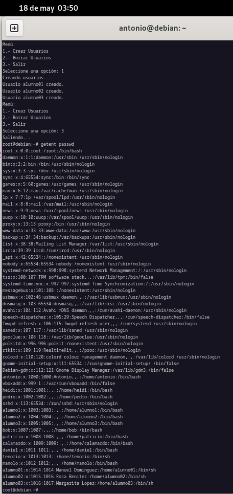

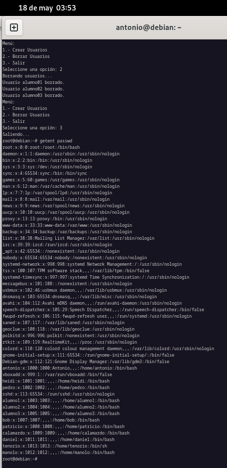

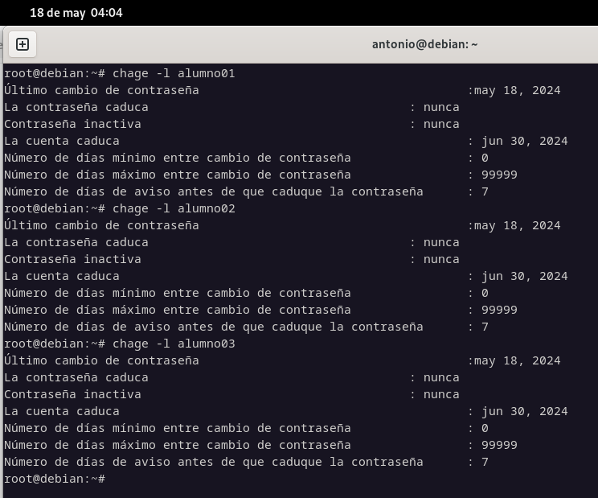
---

### <a name="enunciado-ejercicio-4"></a>Ejercicio 4

#### Enunciado

Crea en un script llamado crearUsuarios.sh que permita crear usuarios de forma 
automática. Indicaciones: 

>1.- Al script se le pasa dos parámetros: 

>>a) El primer parámetro representa el nombre de un usuario genérico.
>>
>>b) El segundo parámetro representa el número de usuarios que quiere crearse.

>2.- A cada usuario se le asigna la contraseña que coincida con el nombre de usuario. 
>3.- Al usuario se le obliga a cambiar de contraseña, cuando se loguee. 
>4.- Se crea un archivo: usuariosCreados-FechaActual.tmp con el nombre de los usuarios 
>creados y la contraseña asignado, separados por “:”. 
>5.- El archivo usuariosCreados-FechaActual.tmp tiene que ser mostrado en pantalla tras 
>la ejecución del script. 

#### Código

```sh
#!/bin/bash
#Autores: German Lamela, José Manuel Carmona y Antonio Tenorio.
#Versión: 1.0
#Descripción: Ejercicio 4. Crear usuarios de forma automática, asignandoles contraseña y obligándole a cambiarla.
#Fecha: 09/05/2024
#Bloque principal
# Verificamos que se pasaron dos parámetros.
if [ "$#" -ne 2 ]; then
	echo "Proporciona nombre de usuario y número: $0 <nombre> <numeroUsuarios>"
	exit 1
fi

nombre=$1
numeroUsuarios=$2
fechaActual=$(date +%d-%m-%Y)
archivoUsuarios="usuariosCreados-$fechaActual.tmp"

# Creamos usuarios.
for i in $(seq 1 $numeroUsuarios);
do
	nombreUsuario="$nombre$i"
	contrasena="$nombreUsuario"

# Creamos el usuario.
	useradd -m -s /bin/bash "$nombreUsuario"

# Asignamos la contraseña.
	echo "$nombreUsuario:$contrasena" | chpasswd

# Forzamos a los usuarios que creemos a cambiar la contraseña en el primer inicio de sesión.
	chage -d 0 "$nombreUsuario"

# Agregamos los usuarios y las contraseñas al archivo.
	echo "$nombreUsuario:$contrasena" >> "$archivoUsuarios"
done

# Mostramos el archivo de los usuarios creados.
	echo "Usuarios creados y contraseñas:"
	cat "$archivoUsuarios"
```
### Desarrollo

1. **Objetivo**
   - Desarrollar un script que automatice la creación de usuarios en un sistema Linux, asignándoles contraseñas y obligándolos a cambiarlas en el primer inicio de sesión.
   - **Razón**: Simplificar el proceso de creación de múltiples usuarios en un sistema, asegurando la seguridad al forzar el cambio de contraseña inicial.

2. **Recolección de Requisitos**
   - **Funcionalidad Principal**: El script debe:
     - Crear usuarios de forma automática a partir de un nombre base y un número especificado.
     - Asignar contraseñas a los usuarios recién creados.
     - Forzar a los usuarios a cambiar sus contraseñas en su primer inicio de sesión.
     - Generar un archivo de registro que contenga los nombres de usuario y sus contraseñas asociadas.
   - **Parametrización**: Se espera que se pasen dos parámetros al script: el nombre base para los usuarios y el número de usuarios a crear.
   - **Seguridad**: Asegurar que las contraseñas sean establecidas y que los usuarios sean obligados a cambiarlas para mejorar la seguridad del sistema.

3. **Diseño del Script**
   - **Estructura del Script**: Un bloque principal que verifica los parámetros pasados al script y luego itera para crear los usuarios y asignarles contraseñas.
   - **Creación de Usuarios**: Utiliza un bucle `for` para crear usuarios con nombres generados dinámicamente.
   - **Asignación de Contraseñas**: Usa el comando `chpasswd` para establecer las contraseñas de los usuarios.
   - **Forzar Cambio de Contraseña**: Emplea `chage` para obligar a los usuarios a cambiar sus contraseñas en su primer inicio de sesión.
   - **Registro de Usuarios**: Guarda los nombres de usuario y contraseñas en un archivo temporal para futuras referencias.
   - **Problema y solución**: Cuando ponemos una contraseña que contenga el nombre del usuario la consola nos advierte de que no es recomendable, pero no tiene mucha importancia.


#### Solución final

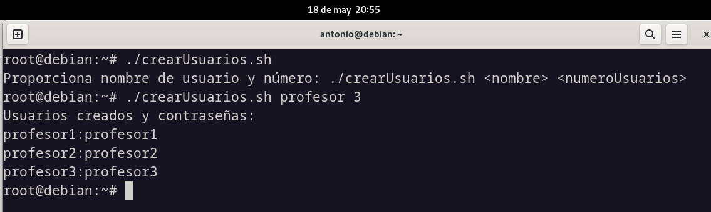

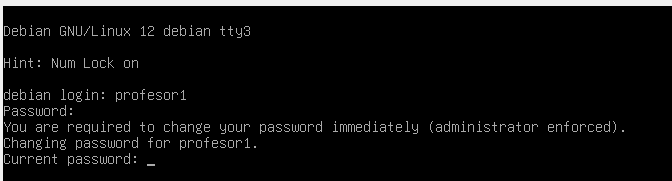

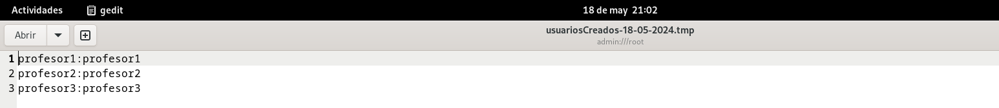

---

### <a name="enunciado-ejercicio-5"></a>Ejercicio 5

#### Enunciado

Partimos de que tenemos varios usuarios: usuario1, usuario2, usuario3.  

Al usuario1, se le ha establecido una cuota de disco: 40k y 100K (soft y hard 
respectivamente).  

Realiza un script llamado cuotasUsuarios.sh, que nos copie la cuota del usuario1 a todos 
los usuarios cuyo uid >1000 y uid<2000.

#### Código
```sh
#!/bin/bash
#Autores: German Lamela, José Manuel Carmona y Antonio Tenorio.
#Versión: 1.0
#Descripción: Ejercicio 5. Tenemos 3 usuarios/as y a un usuario se le ha establecido una cuota de disco. Copiamos la cuota establecida del usuario1 a todos los usuarios/as cuyo UID esté entre 1000 y 2000. 
#Fecha: 12/05/2024
#Funciones

clear

# Función para copiar cuota del usuario1 a otros usuarios.
copiarCuota() {
    echo "Copiando cuota del usuario1 a otros usuarios..."
    usuario1_soft=$(quota -u usuario1 | awk 'NR==3{print $2}')
    usuario1_hard=$(quota -u usuario1 | awk 'NR==3{print $3}')

    # Filtramos sobre los usuarios cuyo UID está entre 1000 y 2000.
    for user in $(awk -F: '$3 >= 1000 && $3 < 2000 {print $1}' /etc/passwd); do
        setquota -u "$user" "$usuario1_soft" "$usuario1_hard" 0 0 /
        echo "Cuota del usuario1 copiada a $user."
    done
}

# Bloque Principal
copiarCuota
```

### Desarrollo

1. **Objetivo**
   - Desarrollar un script que copie la cuota de disco establecida para un usuario específico a otros usuarios en un sistema Linux.
   - **Razón**: Simplificar el proceso de asignación de cuotas de disco para varios usuarios, asegurando la coherencia en la gestión de recursos del sistema.

2. **Recolección de Requisitos**
   - **Funcionalidad Principal**: El script debe:
     - Copiar la cuota de disco establecida para un usuario llamado usuario1 a otros usuarios cuyo UID esté entre 1000 y 2000.
     - Utilizar comandos como `quota` y `setquota` para obtener y establecer cuotas de disco respectivamente.
     - Filtrar los usuarios cuyo UID esté dentro del rango especificado.
   - **Seguridad**: Asegurar que solo los usuarios con UID entre 1000 y 2000 tengan sus cuotas modificadas para evitar efectos no deseados en otros usuarios.

3. **Diseño del Script**
   - **Estructura del Script**: El script sigue una estructura simple con un único bloque principal que llama a la función `copiarCuota`.
   - **Obtención de Cuota del Usuario1**: Utiliza el comando `quota` para obtener la cuota suave y dura establecida para el usuario1.
   - **Copia de Cuota a Otros Usuarios**: Itera sobre los usuarios cuyo UID está dentro del rango especificado y utiliza `setquota` para establecer la misma cuota que usuario1.
   - **Seguimiento de Progreso**: Imprime mensajes indicando la copia exitosa de la cuota de usuario1 a cada usuario afectado.
     


#### Solución final
**Problema**: A la hora de implementar las coutas no hemos conseguido configurar el punto de montaje de los usuarios correctamente, por lo tanto no podemos comprobar la función del script. Por lo tanto, aunque seguramente el código esté bien diseñado no podemos aportar las capturas que lo demuestren.
---

## <a name="bibliografia"></a>Bibliografía

- Diapositivas del curso

- mclibre

- chatgpt


---

## <a name="conclusiones"></a>Conclusiones

Después de completar este proyecto, hemos experimentado un significativo aumento en nuestras habilidades en el campo del scripting en bash. Este desafío nos ha llevado a mejorar nuestro control sobre el lenguaje y a prestar una atención al detalle aún más exhaustiva que en los proyectos realizados durante el segundo trimestre. Cada script requería un enfoque meticuloso y una comprensión profunda de los comandos y estructuras de bash. Esta experiencia no solo ha fortalecido nuestras habilidades técnicas, sino que también ha mejorado nuestra capacidad para resolver problemas de manera eficiente y automatizar tareas repetitivas en entornos Linux. En resumen, este proyecto ha sido una valiosa oportunidad de crecimiento y aprendizaje en el campo del scripting, preparándonos mejor para enfrentar desafíos similares en el futuro.
