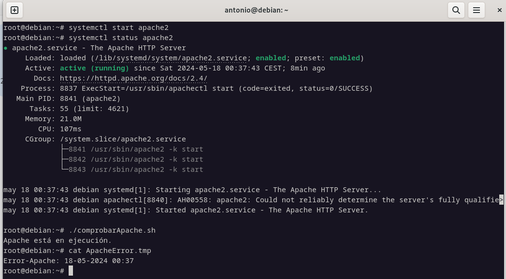
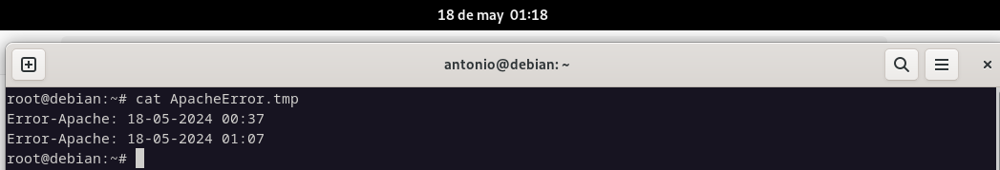

## Índice

1. [Ejercicio 1](#enunciado-ejercicio-1)
2. [Ejercicio 2](#enunciado-ejercicio-2)
3. [Ejercicio 3](#enunciado-ejercicio-3)
4. [Ejercicio 4](#enunciado-ejercicio-4)
5. [Ejercicio 5](#enunciado-ejercicio-5)
6. [Bibliografía](#bibliografia)
7. [Conclusiones](#conclusiones)

---

## Contenido

### <a name="enunciado-ejercicio-1"></a>Ejercicio 1

#### Enunciado

Realiza un script llamado comprobarApache.sh, que compruebe cada minuto si el 
servicio apache2 está activo (running). 

Si está parado, entonces:

>1.- Introduce una línea: “Error-Apache: Fecha y hora actual” en /root/ApacheError.tmp, 
>donde FechaActual, representa día, mes, año, hora y minuto.

>2.- Reinicia el servicio apache2
>Para comprobarlo, para el servicio. Ejecuta el script en segundo plano y observa si lo 
>reinicia y crea el archivo.

>3.- Además del script, crea una tarea programada, de forma que ese script se ejecute cada 
>6 horas, todos los días. Y si el ordenador está apagado, se debe ejecutar la próxima vez 
>que se inicie, transcurrido cinco minutos.

#### Desarrollo

```sh
#!/bin/bash
#Autores: German Lamela, José Manuel Carmona y Antonio Tenorio.
#Versión: 1.0
#Descripción: Ejercicio 1. Comprueba cada minuto que el servicio Apache2 esté activo y tiene una tarea programada para que se ejecute cada 6 horas todos los días, si el pc está apagado.
#Fecha: 01/05/2024
#Bloque principal

# Comprobamos si el servicio Apache está activo.
existe=$(systemctl status apache2 | grep -w "active")	
if ! [ -z "$existe" ]; 
then
	echo "Apache está en ejecución."
else
	fechaActual=$(date "+%d-%m-%Y %H:%M")
	echo "Error-Apache: $fechaActual" >> /root/ApacheError.tmp

	# Reiniciamos el servicio Apache.
	sudo systemctl restart apache2
	echo "Apache se esta reiniciado..."
fi
```


#### Solución final








---

### <a name="enunciado-ejercicio-2"></a>Ejercicio 2

#### Enunciado

Realiza un script llamado usuariosBloqueados.sh, que nos muestre un menú:


  >1.- Usuarios Bloqueados.
  
  >2.- Bloquear un usuario.
  
  >3.- Desbloquear usuario.
  
  >4.- Cerrar sesión usuario
  
  >5.- Salir

  
Cada opción del menú corresponde con una función.

UsuariosBloqueados → nos muestra en pantalla los usuarios (uid>1000 y <2000) que 
tengan la cuenta bloqueada.

BloquearUsuario → Nos pregunta el nombre de un usuario y lo bloqueamos.

DesbloquearUsuario → Nos pregunta el nombre de un usuario y lo desbloqueamos.

CerrarSesion → Nos pregunta el nombre de un usuario, y si el usuario lleva más de 30 
minutos (1800 seg) sin actividad, se le cierra la sesión.


#### Desarrollo

```sh
#!/bin/bash
#Autores: German Lamela, José Manuel Carmona y Antonio Tenorio.
#Versión: 1.0
#Descripción: Ejercicio 2
#Fecha: 10/05/2024
#Funciones

clear

usuariosBloqueados() {
	echo "Usuarios bloqueados:"
	sudo awk -F':' '$3 >= 1000 && $3 < 2000 { system("passwd -S " $1) }' /etc/passwd | awk '$2 == "L" { print $1 }'
}

bloquearUsuario() {
	read -p "Introduce el nombre de usuario a bloquear: " usuario
	usermod -L $usuario 2>&1
	exit 1
	echo "El usuario $usuario ha sido bloqueado."
}

desbloquearUsuario() {
	read -p "Introduce el nombre de usuario a desbloquear: " usuario
	usermod -U $usuario 2>&1
	exit 1
	echo "El usuario $usuario ha sido desbloqueado."
}

cerrarSesionUsuario() {

# Solicitamos el nombre del usuario/a al que queremos cerrarle sesion.
	read -p "Introduce el nombre de usuario/a a cerrar sesion: " usuario

# Verificamos si el usuario/a está conectado.
	if who | grep -qw "$usuario"; then

# Obtenemos el tiempo de inactividad del usuario/a.
	tiempoInactivo=$(w -h | awk -v user="$usuario" '$1 == user { print $5 }' | \
awk -F: '{
    if (NF == 3) {
        # Formato HH:MM:SS
        print ($1 * 3600) + ($2 * 60) + $3
    } else if (NF == 2) {
        # Formato MM:SS
        print ($1 * 60) + $2
    } else {
        # Formato SS
        print $1
    }
}')

# Comparamos el tiempo que el usuario/a lleva de inactividad, como máximo puede estar 1800 segundos (30 minutos).
    if [ "$tiempoInactivo" -gt 1800 ] 2> /dev/null
    then 
	# Cerramos la sesión del usuario/a.
	pkill -KILL -u "$usuario" 
        echo "La sesión del $usuario ha sido cerrada debido a una prolongada inactividad."
    else
        echo "El usuario $usuario está activo." 
    fi
    else
    echo "El usuario $usuario no está conectado actualmente."
fi

}

#Bloque principal
while true; 
do
	echo "-----------MENU-----------"
	echo "1.- Usuarios Bloqueados."
	echo "2.- Bloquear un usuario."
	echo "3.- Desbloquear usuario."
	echo "4.- Cerrar sesion usuario."
	echo "5.- Salir."
	
	read -p "Selecciona una opción: " opcion

	case $opcion in
	
	1)
		usuariosBloqueados
	;;
	
	2)
		bloquearUsuario
	;;

	3)
		desbloquearUsuario
	;;

	4)
		cerrarSesionUsuario
	;;

	5)
		exit
	;;

		*)

		echo "Opcion no valida. Por favor, selecciona una opción del menu. "
	;;

	esac
	echo " "
done


```

#### Solución final


---

### <a name="enunciado-ejercicio-3"></a>Ejercicio 3

#### Enunciado

Realiza un script llamado crearBorrarUsuarios.sh, que nos muestre un menú:

>1.- Crear Usuarios.

>2.- Borrar Usuarios.

>3.- Salir

CrearUsuarios → Crea de forma masiva usuarios almacenados en el fichero 
/root/usuarios.csv

Los campos son los siguientes:

- El campo 1 representa el nombre de usuario.
- El campo 2 representa la contraseña.
- El campo 3 representa el nombre.
- El campo 4 representa su primer apellido.
- El campo 5 representa su correo electrónico.
  
Además, queremos que esas cuentas queden inactivas el 30 de junio de 2024.

BorrarUsuarios → Borra de forma masiva usuarios almacenados en el fichero 
/root/usuarios.csv.

#### Desarrollo

```sh
#!/bin/bash
#Autores: German Lamela, José Manuel Carmona y Antonio Tenorio.
#Versión: 1.0
#Descripción: Ejercicio 3. Muestra un menú interactivo que permite a los usuario/as elegir entre crear usuarios/as, borrar usuarios/as o salir del script.
#Fecha: 10/05/2024
#Funciones

clear

# Función para crear usuarios
crearUsuarios() {
    echo "Creando usuarios..."
    while IFS=':' read -r username password name surname email; do
        useradd -m -p "$(openssl passwd -1 "$password")" -c "$name $surname" -e "2024-06-30" "$username"
        echo "$username:$password" | chpasswd
        echo "$email" > "/home/$username/email.txt"
        echo "Usuario $username creado."
    done < "/root/usuarios.csv"
}

# Función para borrar usuarios
borrarUsuarios() {
    echo "Borrando usuarios..."
    while IFS=':' read -r username _; do
        userdel -r "$username" 2> /dev/null
        echo "Usuario $username borrado."
    done < "/root/usuarios.csv"
}

# Función principal del script
mostrarMenu() {
    while true; do
        echo "Menú:"
        echo "1.- Crear Usuarios"
        echo "2.- Borrar Usuarios"
        echo "3.- Salir"
        read -rp "Seleccione una opción: " opcion

        case $opcion in
            1) crearUsuarios ;;
            2) borrarUsuarios ;;
            3) echo "Saliendo..."; exit 0 ;;
            *) echo "Opción inválida. Por favor, seleccione 1, 2 o 3." ;;
        esac
    done
}

# Llamada a la función principal
mostrarMenu
```

#### Solución final


---

### <a name="enunciado-ejercicio-4"></a>Ejercicio 4

#### Enunciado

Crea en un script llamado crearUsuarios.sh que permita crear usuarios de forma 
automática. Indicaciones: 

>1.- Al script se le pasa dos parámetros: 

>>a) El primer parámetro representa el nombre de un usuario genérico.
>>
>>b) El segundo parámetro representa el número de usuarios que quiere crearse.

>2.- A cada usuario se le asigna la contraseña que coincida con el nombre de usuario. 
>3.- Al usuario se le obliga a cambiar de contraseña, cuando se loguee. 
>4.- Se crea un archivo: usuariosCreados-FechaActual.tmp con el nombre de los usuarios 
>creados y la contraseña asignado, separados por “:”. 
>5.- El archivo usuariosCreados-FechaActual.tmp tiene que ser mostrado en pantalla tras 
>la ejecución del script. 

#### Desarrollo

```sh
#!/bin/bash
#Autores: German Lamela, José Manuel Carmona y Antonio Tenorio.
#Versión: 1.0
#Descripción: Ejercicio 4. Crear usuarios de forma automática, asignandoles contraseña y obligándole a cambiarla.
#Fecha: 09/05/2024
#Bloque principal
# Verificamos que se pasaron dos parámetros.
if [ "$#" -ne 2 ]; then
	echo "Proporciona nombre de usuario y número: $0 <nombre> <numeroUsuarios>"
	exit 1
fi

nombre=$1
numeroUsuarios=$2
fechaActual=$(date +%d-%m-%Y)
archivoUsuarios="usuariosCreados-$fechaActual.tmp"

# Creamos usuarios.
for i in $(seq 1 $numeroUsuarios);
do
	nombreUsuario="$nombre$i"
	contrasena="$nombreUsuario"

# Creamos el usuario.
	useradd -m -s /bin/bash "$nombreUsuario"

# Asignamos la contraseña.
	echo "$nombreUsuario:$contrasena" | chpasswd

# Forzamos a los usuarios que creemos a cambiar la contraseña en el primer inicio de sesión.
	chage -d 0 "$nombreUsuario"

# Agregamos los usuarios y las contraseñas al archivo.
	echo "$nombreUsuario:$contrasena" >> "$archivoUsuarios"
done

# Mostramos el archivo de los usuarios creados.
	echo "Usuarios creados y contraseñas:"
	cat "$archivoUsuarios"
```

#### Solución final


---

### <a name="enunciado-ejercicio-5"></a>Ejercicio 5

#### Enunciado

Partimos de que tenemos varios usuarios: usuario1, usuario2, usuario3.  

Al usuario1, se le ha establecido una cuota de disco: 40k y 100K (soft y hard 
respectivamente).  

Realiza un script llamado cuotasUsuarios.sh, que nos copie la cuota del usuario1 a todos 
los usuarios cuyo uid >1000 y uid<2000.

#### Desarrollo

[Detalle del desarrollo del ejercicio 5, incluyendo problemas encontrados y soluciones propuestas.]

#### Solución final

[Presentación de la solución final del ejercicio 5, acompañada de capturas de pantalla verificando su correcto funcionamiento.]

---

## <a name="bibliografia"></a>Bibliografía

Diapositivas del curso

mclibre

chatgpt


---

## <a name="conclusiones"></a>Conclusiones

[Conclusiones del trabajo realizado.]

